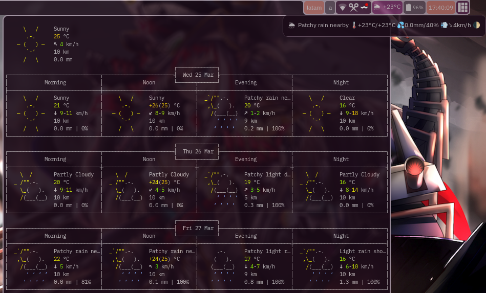

# AwesomeWm wttr widget

A simple (lie) widget to get the weather forecast on your statusbar




## how to use

First clone the widget repo to your awesome config dir
```sh
cd $HOME/.config/awesome
git clone https://github.com/eylles/awesomewm-wttr-widget
```

Now in your rc.lua require and configure it like so:

```lua
-- wttr
local weather_widget = require("awesomewm-wttr-widget")
local wttr = weather_widget({
    -- this is assuming your terminal emulator was set before in the config
    -- your terminal emulator MUST support the "-g" flag to get geometry in
    -- the form of "125x40+0+20", it MUST also support the "-T" flag to
    -- provide a title and of course the "-e" flag to provide a program to run
    -- terminals like urxvt and even the ancient over 40 years old xterm do
    -- support those flags correctly, if your terminal of choice doesn't then
    -- just do yourself a favour and use a good terminal emulator.
    terminal = terminal,
})
-- wttr daemon provider
require("awesomewm-wttr-widget.signal")


-- some more awesome config here
    -- this is the default wibar as an example
    -- Add widgets to the wibox
    s.mywibox:setup {
        layout = wibox.layout.align.horizontal,
        { -- Left widgets
            layout = wibox.layout.fixed.horizontal,
            mylauncher,
            s.mytaglist,
            s.mypromptbox,
        },
        s.mytasklist, -- Middle widget
        { -- Right widgets
            layout = wibox.layout.fixed.horizontal,
            mykeyboardlayout,
            wibox.widget.systray(),
            wttr,
            mytextclock,
            s.mylayoutbox,
        },
    }

-- inside your rules add this
    { rule = { name = "ForecastView" },
        properties = {
            floating = true, titlebars_enabled = false, skip_taskbar = true, ontop = true,
            placement = awful.placement.next_to_mouse+awful.placement.no_offscreen
        }
    },
```

And reload awesome, you will get something in your bar as the daemon is running curl'ing info from wttr.in, but you also want to configure the daemon, the configuration will be in `${XDG_CONFIG_HOME:-${HOME}/.config}/awesome/wttr-daemon/configrc`, it is a simple key=value file (i could not figure out a nice way to configure this thing in lua from the require, so if anyone does that is an ez PR), the daemon will write the default config upon first run, which ya can then edit for a guide on the possible formats and location look at [wttr.in](https://github.com/chubin/wttr.in), it will look like this:

```sh
cache_timeout=60
location=
textbox_format=%c%t/%f+%m
tooltip_format=%c%C+🌡️%t/%f+💦%p/%h+💨%w+〽%P+%m
language=en
```

After editing the file just reload awesome and the daemon (awesome-wttr.sh) will fetch the information according to your config (eventually, depends on your cache_timeout, which is in seconds) then send it over to awesome for displaying.

### But how do i make my wdget look like yours?

It is just a textbox, just wrap it inside other widgets, like so:
```lua
            wibox.container.background(
                wibox.container.margin(
                    wibox.widget{
                        wttr,
                        layout = wibox.layout.align.horizontal
                    },
                    2, 2),
                "#702d63",
                gears.shape.rounded_rect
            ),
```

## Thanks

This widget was inspired by [wttr-widget](https://github.com/pivaldi/wttr-widget) using the way that [streetturtle's widgets](https://github.com/streetturtle/awesome-wm-widgets) usually work (a table with a worker function and a metatable which returns the worker) and the idea of using terminals as pop-ups from [gobo-awesome-sound](https://github.com/gobolinux/gobo-awesome-sound)


# how does this crazy widget work

Now this may be of interest to some, one of my frustrations to call it that way is to use awesome watch to have the cycling be done inside awesome, with this widget the whole cycle of "fetch information, parse and process it, then make it available for display in the widgets" is done OUTSIDE awesome and sent through signals (awesome-client can use awesome.emit_signal), then the widget just connects to the signal and uses an update function to handle the data, that way the widgets can be as dumb as possible and hopefully use the least amount of memory possible along being responsive, unfortunately writing widgets in this manner is more complex than any other way...
